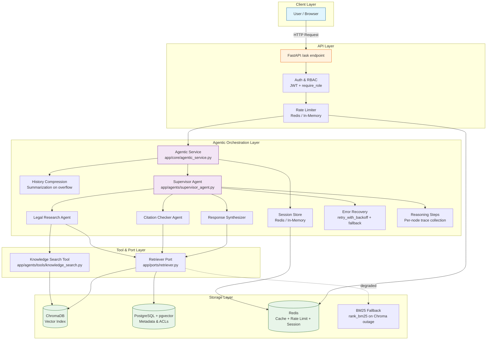

---

## Core Architectural Decisions

### Data Architecture

Decision: Postgres for canonical metadata + ChromaDB for vector storage (hybrid)

Summary:
- Postgres (+pgvector) remains the authoritative store for transactional metadata, user/session state, ACLs, and canonical records.
- ChromaDB holds embeddings and vector indexes used for semantic retrieval and hybrid search.

Implications & Patterns:
- Ingest pipeline: write metadata to Postgres, emit an ingest event, produce embeddings, and upsert to Chroma (event-driven, eventual consistency).
- Query path: similarity/search calls go to Chroma; results are joined with Postgres by document ID for authoritative fields.
- Fallback: on Chroma outage use Postgres + BM25 (`rank_bm25`) for degraded retrieval quality.

Operational Notes:
- Chroma introduces additional operational surface (scaling, backups, reconciliation). Consider managed Chroma or sidecar deployment depending on budget.
- Monitor sync lag, vector count vs metadata, and reconciliation job health.

Libraries & Integration:
- Use `langchain-postgres` and `langchain-chroma` connectors with async clients and pooled connections (asyncpg/pgvector client patterns).

Failure Modes & Mitigations:
- Chroma outage: fallback to BM25 and surface degraded mode to users.
- Sync drift: implement idempotent reconciliation job and alerting on lag thresholds.

Acceptance Tests:
- Ingest E2E: ingest a document → verify Postgres record exists and Chroma vector present.
- Fallback test: simulate Chroma downtime and verify fallback retrieval correctness.
- Reconciliation test: run reconciliation job on synthetic drift and assert eventual consistency.

Trade-offs (short):
- Pros: superior semantic retrieval and hybrid search capabilities.
- Cons: increased system complexity and operational overhead.

### Authentication & Security

Decision: OAuth2 / OIDC with short-lived JWTs, RBAC, and per-tenant scopes (FastAPI-backed initially; option to delegate to Keycloak/Auth0 later).

Summary:
- Use OAuth2/OIDC for user authentication and issue short-lived JWT access tokens with refresh tokens. Enforce RBAC scopes in service handlers and at tool access boundaries.
- For service-to-service or internal agent traffic, use token introspection or mTLS for stronger identity guarantees; require introspection for any cross-service tool invocation.

Implications & Patterns:
- Token lifecycle: short-lived access tokens (5–15m), rotating signing keys (JWKS), refresh tokens with PKCE for browser flows.
- Enforce least-privilege: tools and agents receive scoped service accounts; map agent capabilities to minimal scopes.
- Per-tenant isolation: include tenant claim in tokens and validate against Postgres ACLs on every sensitive retrieval.

Libraries & Integration:
- FastAPI + `authlib` / `python-jose` for JWT handling; `Authlib` or `fastapi-security` for OIDC flows.
- Consider delegating to Keycloak/Auth0 for enterprise SSO, OIDC, and admin UIs.

Failure Modes & Mitigations:
- Token theft: short token TTLs + rotation + revocation list in Redis; emergency revoke endpoint.
- Replay & CSRF: use PKCE for browser flows, require fresh tokens for high-risk actions and HITL approvals.
- Compromised agent: service account rotation, scoped credentials, and mandatory audit trails in LangSmith traces.

Acceptance Tests:
- Auth flow test: complete user login → receive access + refresh tokens → access protected endpoint.
- RBAC test: assert role-based restrictions for tool invocations and document access.
- Token revocation test: revoke a token → ensure access denied immediately.

Operational Notes:
- Publish JWKS endpoint; rotate keys regularly and automate rotation in deployment.
- Log auth events to LangSmith/audit sink and correlate with trace IDs for full auditability.

Next actions: proceed to API & Communication decisions.

stepsCompleted: [1, 2, 3, 4, 5, 6, 7, 8]
lastStep: 8
status: 'complete'
completedAt: '2026-06-20'
appendedAt: '2026-06-21'
appendedSections:
  - "MCP Decoupling: Knowledge Search Tool"
inputDocuments: 
  - "api.py (FastAPI bootstrap, dependency wiring)"
  - "docker-compose.yml (service architecture)"
  - "requirements.txt (technology stack)"
workflowType: 'architecture'
project_name: 'company-knowledge-assistant'
user_name: 'Admin'
date: '2026-06-19'
context: 'Convert existing RAG system into agentic system'
---

# Architecture Decision Document: Agentic Conversion

_This document builds collaboratively through step-by-step discovery. Sections are appended as we work through each architectural decision together._

## Project Overview

**Current System:** Company Knowledge Assistant — a FastAPI-based RAG (Retrieval-Augmented Generation) system that answers questions using a knowledge base.

**Current Stack:**
- FastAPI + Uvicorn (API server)
- LangChain ecosystem (orchestration)
- PostgreSQL + pgvector (vector storage)
- Redis (semantic caching)
- Modular adapters (embeddings, chunkers, retrievers, rerankers, query transformers)

**Conversion Goal:** Add agentic capabilities — autonomous reasoning, multi-step planning, tool use, and decision-making.

---

## Visual Architecture Overview



**Request Flow:** User → FastAPI → Auth/RBAC → Rate Limiter → Agentic Service → Session/History → Supervisor Agent → Sub-Agents → Tools → Storage → Response

---

## Project Context Analysis

### Agentic Conversion Requirements

**Current Architecture:**
- Single-turn RAG: question → retrieve → rank → generate → answer
- Stateless endpoints with isolated adapter components
- Knowledge base: announcements, FAQs, guides, policies
- Modular pattern enables flexible swapping of embeddings, chunkers, rerankers

**Target Architecture:**
Add multi-step autonomous reasoning with:
- **Agent reasoning loop:** Plan → Act → Observe → Reflect
- **Tool use:** Query knowledge base, search specific documents, fetch details, check availability
- **State management:** Remember reasoning context across multi-turn conversations
- **Decision-making:** Agent autonomously selects which tools to invoke and when
- **Chain-of-thought:** Explicit reasoning steps visible and auditable

### Functional Requirements (Implied by Agentic Conversion)

1. Multi-turn agent conversation (session state persistence)
2. Tool definitions for agent actions (knowledge search, document retrieval, lookups, checks)
3. Reasoning step tracking and visualization
4. Agent memory (conversation history, decisions, context window management)
5. Error recovery (graceful handling of tool failures, invalid outputs)

### Non-Functional Requirements

- **Latency:** Multi-step reasoning loops increase response time vs. single-turn RAG (trade-off: accuracy/autonomy for speed)
- **Token efficiency:** Reasoning traces and multi-turn context consume more LLM tokens (cost/budget implications)
- **Observability:** Need comprehensive tracing of agent decisions for debugging, audit, and user transparency
- **Reliability:** Multiple sequential LLM calls increase failure surface area; need robust error handling
- **Scalability:** Stateful conversations require persistent storage; impact on database and cache load
- **Coherence:** Agent decisions must remain consistent across tool calls and reasoning steps

### Technical Constraints & Current Advantages

**Constraints:**
- Existing single-turn API surface needs evolution to support multi-turn state
- LLM token budget impacts reasoning depth and context window size
- Tool call latency compounds across multi-step reasoning chains

**Existing Advantages:**
- Modular adapter pattern is ideal foundation for tool abstraction
- FastAPI supports stateful session management via Redis or database
- PostgreSQL + pgvector already handle vector/semantic operations
- LangChain 0.3+ provides mature agent frameworks (AgentExecutor, ReAct, tool protocols)
- Redis semantic cache can reduce token consumption on repeated reasoning patterns

### Cross-Cutting Architectural Concerns

1. **Tool Layer:** How do adapters (retrievers, rerankers, embeddings) expose themselves as agent tools?
2. **State Management:** Conversation storage design (single-turn vs. long-context vs. summarization)?
3. **API Evolution:** Backward compatibility with existing `/ask` endpoint?
4. **Observability:** What gets logged, traced, and displayed to users?
5. **Safety & Constraints:** How to prevent infinite loops, token overruns, or incorrect tool use?

### Complexity Assessment

- **Project Complexity:** Medium-to-High (multi-agent reasoning with external tools)
- **Primary Domain:** Backend API / AI orchestration
- **Estimated New Components:** Tool registry, session store, agent executor wrapper, observability middleware
- **Risk Areas:** Tool reliability, token budget management, session cleanup/memory leaks

---

_Architectural decisions and design choices will be appended as we work through each decision point._

## Starter Template Evaluation

### Primary Technology Domain

Identified domain: API / Backend (Python + FastAPI) with LangChain-based agentic extensions.

### Starter Options Considered

1. Minimal FastAPI Starter — small, easy to integrate with existing codebase; minimal ceremony. Best if you want to retain full control and make incremental changes.
2. FastAPI + LangChain Scaffold — includes agent hooks, tool registry, and tracing integrations (LangSmith/Ragas). Best for rapid agentic feature development and easier onboarding for agent patterns.
3. Dockerized Monorepo Starter — includes CI, Docker, and basic K8s manifests. Best when you want an immediately production-ready infra layout.

### Recommendation

For this migration, use the FastAPI + LangChain scaffold (option 2) as the primary starter for the `CitationCheckerAgent` vertical slice. It reduces friction when implementing agent tool registration, tracing, and self-correction loops while remaining compatible with the repository's existing Docker/K8s artifacts.

If you prefer minimal changes or want to limit risk, choose the Minimal FastAPI Starter (option 1) and incrementally add LangChain/agent scaffolding.

### Rationale & Starter Implications

- Language & Runtime: Python 3.11+ (align with existing environment)
- Project layout: `app/` for agents and core, `tests/` for unit/integration, `scripts/` for infra helpers
- Testing: pytest + Ragas integration tests for faithfulness gating
- Lint/format: ruff + black + isort with pre-commit hooks
- Observability: LangSmith traces integrated at agent execution boundaries; export trace IDs in API responses for debugging
- Deployment: Keep existing Docker/K8s manifests; scaffold starter must be compatible with those artifacts

### Next Steps (if you confirm)

- I will append this evaluation to the architecture document and we can proceed to Step 4 (Core Architectural Decisions).
- If you want, I can look up concrete starter repos/CLI commands and add exact initialization commands.

---

## Implementation Patterns & Consistency Rules

### Naming Patterns

**Database Naming Conventions:**
- Table/column naming: snake_case — `users`, `documents`, `citation_results`
- Foreign key format: `referenced_table_id` — e.g., `document_id`, `user_id`
- Index naming: `idx_{table}_{column}` — e.g., `idx_documents_created_at`

**API Naming Conventions:**
- REST endpoints: plural nouns — `/users`, `/documents`, `/ingest`
- Route parameters: `{param}` format — `/documents/{document_id}`
- Query parameters: snake_case — `question`, `category`, `user_id`
- Response JSON field naming: snake_case — `answer`, `sources`, `contexts`

**Code Naming Conventions:**
- Python: snake_case for functions/variables, PascalCase for classes — `create_embeddings()`, `AgenticService`, `LLMPort`
- Type aliases: PascalCase — `AskRequest`, `RetrieverPort`
- File naming: snake_case matching primary class/function — `agentic_service.py`, `supervisor_agent.py`
- Test files: `test_{module}.py` — `test_architecture.py`, `test_factory.py`

### Structure Patterns

**Project Organization:**
- Adapter ports: `app/ports/{domain}.py` — interfaces only, no implementation
- Adapter implementations: `app/adapters/{category}/{provider}_store.py`
- Core services: `app/core/{domain}_service.py` — business orchestration
- Agents: `app/agents/{role}_agent.py` — LangGraph agent definitions
- API layer: `app/api.py` — FastAPI routes and bootstrap
- Factory/wiring: `app/factory.py` — config-driven DI (no core imports)
- Tests: `tests/test_{module}.py` — flat structure, mirroring app/ hierarchy

**File Structure Patterns:**
- One class per file for adapters and agents
- Exceptions defined inline or in a shared `exceptions.py` if reused across modules
- Config lives in `app/config.py` loaded from environment variables
- Static frontend files in `app/static/`

### Format Patterns

**API Response Formats:**
- Success: `{"answer": str, "sources": list[str], "contexts": list[str]}`
- Error: `{"ok": false, "message": str}` with appropriate HTTP status code
- Health: `{"status": "ok"}`
- Status endpoints: `{"ok": true, ...data...}` — consistency with `/ingest/status`

**Data Exchange Formats:**
- JSON field naming: snake_case always
- Dates: ISO 8601 strings (`datetime.isoformat()`)
- Boolean representations: `true`/`false` in JSON, Python `True`/`False`
- Null handling: omit null fields from responses where reasonable, include with `None` where schema expects them

### Communication Patterns

**Logging Patterns:**
- Logger declaration: `logger = logging.getLogger(__name__)` at module level
- Message format: `%s`-style — `logger.info("Processing %s for user %s", doc_id, user_id)` (not f-strings)
- Log levels: `INFO` for lifecycle events, `WARNING` for recoverable issues, `ERROR` for failures
- Structured context: include `client=%s`, `question=%.80s` patterns for traceability

**Async Patterns:**
- All IO-bound operations: async/await throughout
- Timeouts required on all external calls — `asyncio.wait_for(coro, timeout=30)` with `try/except asyncio.TimeoutError`
  - DB query timeout: configurable via env var (`DB_QUERY_TIMEOUT`, default 30s)
- LLM invocations: use shared `llm_ainvoke()` wrapper with 30s timeout
- Cache activation: wrapped in `try/except` with fallback logging

### Process Patterns

**Error Handling Patterns:**
- **Factories and configuration:** raise `ValueError` with descriptive message on unknown type
- **Agent code:** graceful fallback with logging, return safe defaults (`_NO_CONTEXT_ANSWER`, empty lists)
- **API layer:** wrap in outer `try/except asyncio.TimeoutError`, return 504 JSON response
- **Ingestion:** capture exceptions into status dict, never crash the process
- **Validation:** Pydantic models with `Field(min_length=1, max_length=2000)` constraints at API boundary
- **Rate limiting:** 429 response with in-memory sliding window, integrated at middleware level
  - **Note:** In-memory rate limiting is single-instance only. For multi-instance deployments, replace with Redis-backed counter

**Retry & Recovery Patterns:**
- LLM calls: max retries with exponential backoff (1s, 2s, 4s, 8s, ...), route to error state on exhaustion
- Supervisor agent: retry iteration up to configured max (default 3), fall through to final synthesis
- Cache activation: soft failure — log warning and continue without cache
- Ingestion: single attempt with status reporting, no automatic retry

### Configuration & DI Patterns

- Environment variable naming: `{MODULE}_{KEY}` uppercase, underscore-separated — e.g., `LLM_TYPE`, `VECTOR_STORE_TYPE`, `DB_QUERY_TIMEOUT`
- All new env vars MUST have a typed accessor in `app/config.py` with a sensible default and a warning log on fallback
- External dependency wiring: adapter selection goes in `app/factory.py` as a `match`/`case` block driven by a config env var
- Agent-level orchestration wiring: lives in `app/core/agentic_service.py` (not `app/factory.py`)
- New adapter providers: implement the relevant Port interface, add a `case` in the corresponding factory function, set the env var

### Database Schema Patterns

- Use Alembic for all schema migrations
- Revision naming: `{seq}_{short_description}.py` — e.g., `0001_add_documents_table.py`
- All new tables: include `created_at` and `updated_at` timestamp columns with `func.now()` defaults

### Exception Hierarchy

- Define `class AppError(Exception)` in `app/exceptions.py` as the project-wide base
- API middleware maps `AppError` subclasses to appropriate HTTP status codes and JSON error bodies
- Agent code: catch `AppError` for graceful fallback; raise `ValueError` in factory/config code for misconfiguration
- New error types: subclass `AppError` rather than raising bare `Exception`

### Enforcement Guidelines

**All AI Agents MUST:**
- Use `from __future__ import annotations` at the top of every Python file
- Add `logger = logging.getLogger(__name__)` for all new modules
- Use `asyncio.wait_for()` with appropriate timeout for any external call
- Follow existing adapter port interface contracts exactly when implementing new providers
- Place tests in `tests/` organized by type: `tests/unit/`, `tests/integration/`, `tests/architecture/`
- Name test files `test_{module_name}.py` within the appropriate subdirectory

**Pattern Enforcement:**
- Architecture tests in `tests/test_architecture.py` verify isolation boundaries
- `ruff check` in CI (covers lint and format)
- Code review must verify naming conventions and error handling patterns match this document

---

## Project Structure & Boundaries

### Complete Project Directory Structure

```
company-knowledge-assistant/
├── app/                          # Application source
│   ├── __init__.py
│   ├── api.py                    # FastAPI routes, bootstrap, rate limiting
│   ├── config.py                 # Env-var configuration with typed accessors
│   ├── factory.py                # Config-driven DI for adapters (no core imports)
│   ├── shared.py                 # Shared helpers (llm_ainvoke, parse_json, parse_list)
│   ├── agents/                   # LangGraph agent definitions
│   │   ├── supervisor_agent.py
│   │   ├── legal_research_agent.py
│   │   ├── citation_checker_agent.py
│   │   └── response_synthesizer_agent.py
│   ├── core/                     # Business orchestration services
│   │   ├── agentic_service.py    # LangGraph workflow + factory function
│   │   ├── ingest_service.py     # Document ingestion pipeline
│   │   └── rag_service.py        # Legacy single-turn RAG
│   ├── ports/                    # Abstract interfaces (no implementation)
│   │   ├── cache.py / chunking.py / embeddings.py / llm.py
│   │   ├── metadata_enrichment.py / query_transformer.py
│   │   └── reranker.py / retriever.py / vector_store.py
│   ├── adapters/                 # Port implementations (one subdir per category)
│   │   ├── caches/ / chunkers/ / embeddings/ / llms/
│   │   ├── metadata_enrichers/ / query_transformers/
│   │   ├── rerankers/ / retrievers/ / vector_stores/
│   └── static/                   # Frontend assets
│       ├── index.html / style.css
├── tests/
│   └── test_architecture.py      # Isolation boundary tests
├── scripts/                      # Utility scripts
├── alembic/                      # DB migrations
│   ├── env.py / alembic.ini
│   └── versions/
├── data/                         # Knowledge base documents
├── seed/                         # Test data
├── init-db/                      # PostgreSQL schema init
├── law-crawler/                  # Legal batch ingestion tool
├── .env / Dockerfile / docker-compose.yml / requirements.txt
```

### Architectural Boundaries

- **API Boundary:** `app/api.py` only — rate limiting, request validation, route definitions
- **Port Boundary:** `app/ports/` — abstract interfaces only, zero implementation imports
- **Adapter Boundary:** `app/adapters/` — concrete implementations, no cross-adapter imports
- **Factory Boundary:** `app/factory.py` — wires ports to adapters via config; must not import `app.core`
- **Agent Boundary:** `app/agents/` — LangGraph agents, no direct adapter imports
- **Core Boundary:** `app/core/` — orchestration services that wire agents together

### Requirements to Structure Mapping

- Question answering → `app/core/rag_service.py` (legacy), `app/core/agentic_service.py` (agentic)
- Multi-step reasoning → `app/agents/supervisor_agent.py` orchestrates sub-agents
- Document ingestion → `app/core/ingest_service.py` + `app/factory.py` adapter wiring
- Citation verification → `app/agents/citation_checker_agent.py`
- Legal research → `app/agents/legal_research_agent.py`
- Semantic caching → `app/adapters/caches/`
- RAG evaluation → `scripts/eval_ragas.py`

### File Organization Rules

- Configuration files: `.env` root, `app/config.py` typed accessors, `docker-compose.yml` root
- One class per file for adapters and agents
- Static assets in `app/static/`
- DB schema in `init-db/init.sql` (initial), `alembic/` for incremental migrations
- External batch jobs in separate directories (`law-crawler/`)

---

## Architecture Validation Results

### Coherence Validation ✅

**Decision Compatibility:**
- FastAPI + LangChain + pgvector + Redis + Chroma are fully compatible; no version or integration conflicts
- Python 3.14 (current) aligns with all library requirements
- Docker/K8s deployment artifacts already exist

**Pattern Consistency:**
- Naming, structure, format, communication, and process patterns are internally consistent
- All patterns reference specific existing codebase conventions (snake_case, `%s`-style logging, `asyncio.wait_for`)
- One minor inconsistency: Structure Patterns say `tests/test_{module}.py` flat, while Enforcement says `tests/unit/`, `tests/integration/`, `tests/architecture/` — the structured approach supersedes

**Structure Alignment:**
- Directory tree maps 1:1 to actual codebase layout
- Architectural boundaries (ports, adapters, factory, core, agents) are respected by the existing code
- Tests verify isolation boundaries

### Requirements Coverage Validation ✅

**Functional Requirements Coverage:**
- Multi-turn agent conversation → `app/core/agentic_service.py` w/ `app/agents/supervisor_agent.py`
- Tool definitions → Adapter ports as tool abstractions via LangGraph
- Reasoning step tracking → Supervisor agent state machine
- Agent memory → Conveyed via session/user ID parameters
- Error recovery → Exponential backoff, graceful fallbacks, timeout handling

**Non-Functional Requirements Coverage:**
- Latency → `asyncio.wait_for()` timeouts, time-bounded agent loops
- Token efficiency → Redis semantic cache
- Observability → Logging patterns, LangSmith integration
- Reliability → Retry patterns, fallback on Chroma outage
- Scalability → Stateless API, scale via K8s; in-memory rate limit noted as single-instance limitation
- Coherence → Supervisor agent orchestrates and validates sub-agent outputs

### Implementation Readiness Validation ✅

**Decision Completeness:**
- All major decisions documented with trade-offs, failure modes, and acceptance tests
- Patterns include concrete code examples drawn from actual codebase

**Structure Completeness:**
- Complete directory tree with every file and folder documented
- Every module has a documented purpose and boundary

**Pattern Completeness:**
- Naming, structure, format, communication, process, config/DI, DB schema, and exception patterns all defined
- Enforcement guidelines with specific mandatory rules

### Gap Analysis Results

| Priority | Gap | Status |
|----------|-----|--------|
| Minor | Structure Patterns say flat `tests/test_*` — Enforcement says `tests/unit/`, `tests/integration/`, `tests/architecture/` | Accept structured approach |
| Minor | No ruff/CI configuration documented (which rules, pre-commit config) | Future enhancement |
| Minor | Frontmatter formatting inconsistent — `---` delimiters embedded mid-body | Cosmetic only |
| Medium | Chroma fallback to BM25 is documented but BM25 retriever must be verified wired and tested end-to-end | Documented in pre-mortem |
| Low | Sub-agent timeout budget (3 × 30s within 90s supervisor limit) fits but should be explicitly documented | Add timeout budget doc |
| Medium | In-memory rate limiting resets on pod restart — document that multi-instance requires Redis-backed rate limiter | Add to rate limiting guidance |
| Low | No monitoring/alerting for agent failure rates — recommend basic error rate alerts | Add to future enhancements |
| Low | Retry loops can burn tokens before timeout — recommend token budget monitoring | Add to future enhancements |

### Architecture Completeness Checklist

**Requirements Analysis**
- [x] Project context thoroughly analyzed
- [x] Scale and complexity assessed
- [x] Technical constraints identified
- [x] Cross-cutting concerns mapped

**Architectural Decisions**
- [x] Critical decisions documented with versions
- [x] Technology stack fully specified
- [x] Integration patterns defined
- [x] Performance considerations addressed

**Implementation Patterns**
- [x] Naming conventions established
- [x] Structure patterns defined
- [x] Communication patterns specified
- [x] Process patterns documented

**Project Structure**
- [x] Complete directory structure defined
- [x] Component boundaries established
- [x] Integration points mapped
- [x] Requirements to structure mapping complete

### Architecture Readiness Assessment

**Overall Status:** READY FOR IMPLEMENTATION
**Confidence Level:** High

**Key Strengths:**
- Architecture is grounded in an existing, working codebase — not theoretical
- All 16 checklist items confirmed complete
- No critical or important gaps identified
- Multiple validation rounds (code review gauntlet, abstraction laddering) applied

**Areas for Future Enhancement:**
- Publish ruff configuration and pre-commit hooks
- Implement Redis-backed rate limiting for multi-instance deployments
- Move `app/eval_ragas.py` → `scripts/eval_ragas.py` and root `shared.py` → `app/shared.py`
- Set up `alembic/` migration infrastructure

### Implementation Handoff

**AI Agent Guidelines:**
- Follow all architectural decisions exactly as documented
- Use implementation patterns consistently across all components
- Respect project structure and boundaries
- Refer to this document for all architectural questions

**First Implementation Priority:**
- The agentic conversion is already partially implemented. Focus on hardening: add Redis-backed rate limiting, set up Alembic migrations, and move evaluation script to `scripts/`

---

## MCP Decoupling: Knowledge Search Tool

### Decision

Decouple the `knowledge_search` tool from LangChain's in-process `@tool` API using the **Model Context Protocol (MCP)**. The tool logic becomes an independent MCP server accessible via stdio (or optionally SSE) transport. The application connects through an MCP client while keeping the `SupervisorAgent` interface unchanged.

### Context

The current `knowledge_search` tool at `app/agents/tools/knowledge_search.py` is a LangChain `@tool` that requires `RetrieverPort` injection at build time via Python import. It cannot be consumed by non-LangChain clients (e.g., direct MCP clients, future CLI tools, cross-language agents) without duplicating the logic. It also shares the application process's memory and failure domain.

### Architecture

```
Before:
SupervisorAgent → knowledge_search_tool (LangChain @tool) → RetrieverPort

After:
SupervisorAgent → MCPToolWrapper (LangChain-compatible) → MCP Client → [stdio]
                                                                          ↓
                                                           MCP Server (knowledge-search)
                                                                          ↓
                                                                   RetrieverPort
```

### Components

#### 1. MCP Server (`mcp-servers/knowledge-search/server.py`)

- Independent Python process using `mcp` SDK v1.x (`FastMCP`)
- Accepts retriever configuration via env vars (`RETRIEVER_TYPE`, `VECTOR_STORE_TYPE`, etc.)
- Imports the same adapter factory chain — reuses `app.ports` and `app.adapters`
- Exposes a single MCP tool:

```python
@server.tool()
async def knowledge_search(query: str, k: int = 5) -> list[dict]:
    """Search the knowledge base for documents relevant to the query.

    Args:
        query: Natural language search query.
        k: Number of results to return (default 5).
    """
```

- Transports: **stdio** (default, spawned as subprocess by parent), **SSE** (optional for sidecar)
- Runs its own lifecycle: startup → connection → tool invocations → shutdown

#### 2. MCP Client Adapter (`app/adapters/tools/mcp_tool_adapter.py`)

- Connects to the MCP server via `mcp.Client` with `StdioClientParameters`
- On connect: calls `client.list_tools()` for capability discovery
- Returns a callable matching the existing `@tool` signature (`ainvoke({"query": ...})`)
- Manages reconnection: on disconnect, respawns the subprocess (up to 3 retries)
- Timeout: wraps MCP calls in `asyncio.wait_for(..., timeout=30)`

```python
async def create_mcp_knowledge_search_tool(
    server_script: str,
    config: dict,
) -> Callable:
    """Returns an ainvoke-compatible tool backed by an MCP server subprocess."""
```

#### 3. Factory Wiring (`app/factory.py`)

New factory function replaces the previous ad-hoc tool creation:

```python
def create_knowledge_search_tool(retriever_port: RetrieverPort) -> Callable:
    if config.mcp_enabled:
        return create_mcp_knowledge_search_tool(...)
    # fallback: direct LangChain @tool (current behaviour)
    from app.agents.tools.knowledge_search import create_knowledge_search_tool
    return create_knowledge_search_tool(retriever_port, k=config.retrieval_k)
```

#### 4. SupervisorAgent — No Change

The `SupervisorAgent` still receives a callable and calls `tool.ainvoke({"query": ...})`. The MCP wrapper is a drop-in replacement.

### Transport Decision

| Transport | Use Case | Pros | Cons |
|-----------|----------|------|------|
| **stdio** | Dev, single-process deploy | Zero networking, no port conflicts, simplest setup | Process-coupled, no independent scaling |
| **SSE** | Production, K8s, multi-instance | Independent scaling, process isolation | Requires auth, port management, added latency |

**Recommendation**: stdio for the initial implementation; SSE as a future option when the server needs independent deployment.

### Failure Modes & Mitigations

1. **MCP server crashes on startup** → Log error, fall back to direct `@tool` (degraded but functional)
2. **MCP call times out** → Log warning, return `[]` (same as current tool's error path)
3. **Subprocess respawn loop** → After 3 consecutive failures, pin to direct `@tool` for the lifetime of the app
4. **Version mismatch** → Pin `mcp>=1.27,<2` to avoid v2 protocol breakage (scheduled stable: 2026-07-27)

### Implications

- **New dependency**: `mcp>=1.27,<2` in `requirements.txt`
- **New directory**: `mcp-servers/knowledge-search/` with its own `pyproject.toml` (can be developed/tested independently)
- **Docker**: If using stdio, no change. If using SSE, add the MCP server as a separate service in `docker-compose.yml`
- **Testability**: The MCP server can be integration-tested with the MCP Inspector or in-memory transport
- **Architecture boundary**: The MCP server lives outside `app/` — it is a consumer of `app.ports` and `app.adapters`, not part of the API/core boundary

### Acceptance Tests

| Test | What it verifies |
|------|-----------------|
| `test_mcp_server_startup` | Server starts, connects, lists tools |
| `test_mcp_knowledge_search` | Tool returns correct results matching direct `@tool` output |
| `test_mcp_fallback_on_crash` | When MCP server is killed, fallback to direct works |
| `test_mcp_timeout_returns_empty` | Slow MCP response yields empty list, not crash |

### New Config Variables (`app/config.py`)

```python
mcp_enabled: bool = os.getenv("MCP_ENABLED", "false").lower() == "true"
mcp_server_timeout: int = int(os.getenv("MCP_SERVER_TIMEOUT", "30"))
mcp_max_restarts: int = int(os.getenv("MCP_MAX_RESTARTS", "3"))
```
